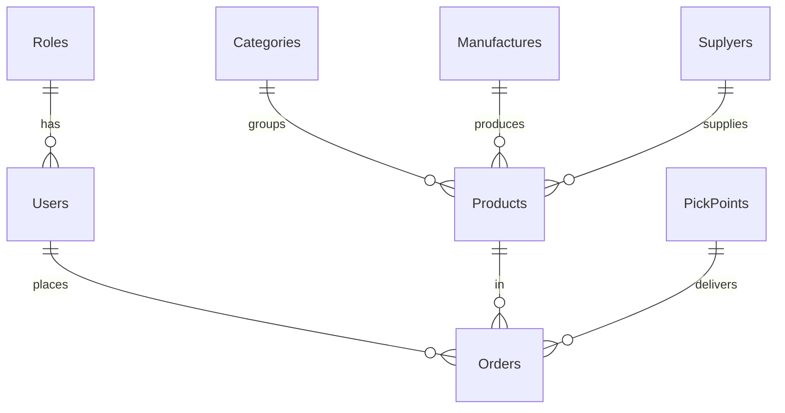

# ER-диаграмма

Схема в третьей нормальной форме. Полная версия — `docs/db_schema.md`. Здесь — кратко.

## Связи

- `Users.role_id → Roles.role_id`
- `Products.category_id → Categories.category_id`
- `Products.manufacture_id → Manufactures.manufacture_id`
- `Products.suplyer_id → Suplyers.suplyer_id`
- `Orders.user_id → Users.user_id`
- `Orders.article → Products.article`
- `Orders.pickpoint_id → PickPoints.pickpoint_id`

По именованию файлов задания: основная картинка ER-диаграммы выгружается из dbdiagram.io / Workbench и сохраняется как `ER_diagram.pdf` (вкладывается отдельно к работе).
