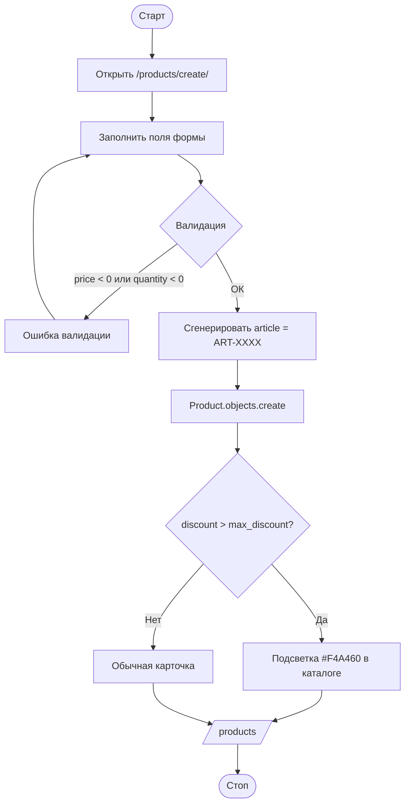

# Алгоритм работы приложения

Обобщённая блок-схема главного сценария: «Авторизация → действие в зависимости от роли».

```mermaid
flowchart TD
    A([Старт]) --> B[Открыть /login/]
    B --> C{Введён логин/пароль}
    C -- Нет --> B
    C -- Да --> D[StoreUserBackend.authenticate]
    D --> E{Пользователь найден?}
    E -- Нет --> F[Сообщение "Неверный логин или пароль"]
    F --> B
    E -- Да --> G[Сохранить user_id и role_id в session]
    G --> H{role_id == ?}
    H -- 1 Админ --> I[Полный доступ: товары + заказы + удаление]
    H -- 2 Менеджер --> J[Товары + заказы без удаления]
    H -- 3 Клиент --> K[Каталог + свои заказы]
    I --> L[/products/]
    J --> L
    K --> L
    L --> M{Действие пользователя}
    M -- Поиск/фильтр --> L
    M -- Создать заказ --> N[/orders/create/]
    N --> O[Order.objects.create]
    O --> P[/orders/]
    M -- Выход --> Q[Очистить session]
    Q --> R([Стоп])
```

## Алгоритм добавления товара (роли Менеджер/Админ)



## Алгоритм оформления заказа (Клиент)

```mermaid
flowchart TD
    A([Старт]) --> B[Открыть карточку товара]
    B --> C{quantity > 0?}
    C -- Нет --> D[Кнопка "Заказать" неактивна, подсветка #87CEEB]
    D --> Z([Стоп])
    C -- Да --> E[Нажать "Заказать"]
    E --> F[Выбрать ПВЗ и количество]
    F --> G{Количество ≤ остатку?}
    G -- Нет --> H[Сообщение об ошибке]
    H --> F
    G -- Да --> I[Создать Order.status = 'Новый']
    I --> J[Сгенерировать pickup_code]
    J --> K[Показать клиенту код самовывоза]
    K --> Z
```
