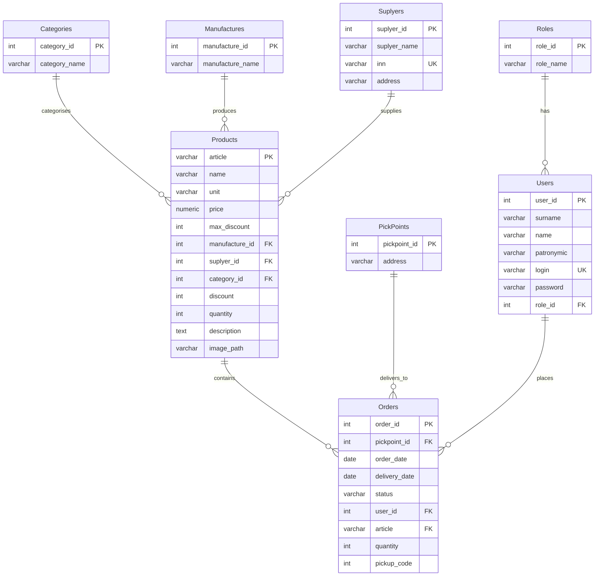

# Схема базы данных (PostgreSQL)

## Ключевые ограничения

- `Products.price` — `NUMERIC(12,2)`, `CHECK price >= 0`.
- `Products.discount`, `Products.max_discount` — `CHECK BETWEEN 0 AND 100`.
- `Products.quantity` — `CHECK quantity >= 0`.
- `Orders.order_date` — `NOT NULL DEFAULT CURRENT_DATE`.
- `Orders.status` — `NOT NULL DEFAULT 'Новый'`.
- Индексы: `Products(category_id)`, `Products(manufacture_id)`, `Orders(user_id)`, `Orders(article)`, `Users(login)`.
