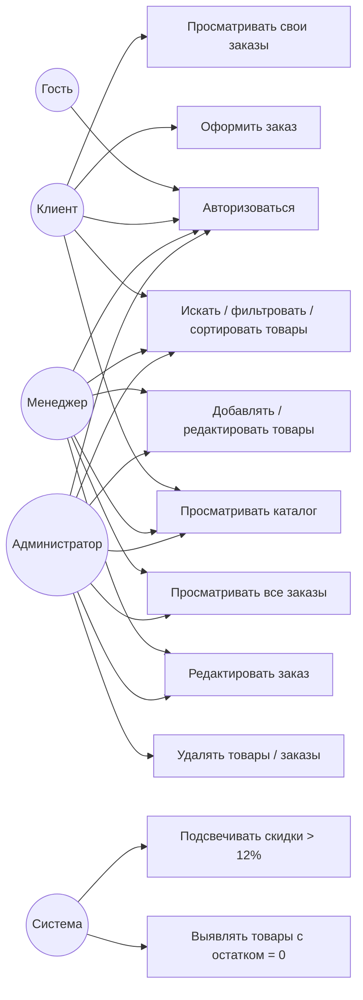

# UML Use Case — диаграмма прецедентов

## Описание ролей

| Роль | role_id | Доступные действия |
| --- | --- | --- |
| Гость | — | Только форма входа |
| Клиент | 3 | Каталог, поиск, оформление и просмотр своих заказов |
| Менеджер | 2 | Всё выше + редактирование товаров и заказов, просмотр всех заказов |
| Администратор | 1 | Всё выше + удаление товаров и заказов |
